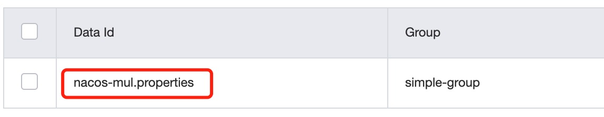

# spring-cloud-alibaba-example

## nacos-config 配置中心
- 不同的namespace下的配置完全隔离
- 不同group下的dataId可以相同
- 不同group下的dataId可以通过spring.cloud.nacos.config.extension-configs配置进行聚合复用
- 在spring.cloud.nacos.config.extension-configs[x].data-id 配置是要特别注意由于其需要添加后缀名，因此要求nacos配置时的dataId也需要带有后缀
   - 如 spring.cloud.nacos.config.extension-configs[x].data-id=nacos-mul.properties 则nacos的配置如下图：
   

### 实践总结
> 多租户共用nacos的情况
- 使用namespace 做租户隔离，使不同租户的配置相互隔离
- 使用group做环境隔离即：使用group区分 dev-env(开发)/test-env(测试)/gray-env(灰度)/pro-env(生产)等
- 使用dataId区分不同用户的配置，如：common.properties/data-source.properties/redis.properties等

**注意:** 在此种用法的情况下，由于nacos支持不同group下的配置聚合复用功能，因此要约定禁用该种配置方式，否则将会出现不同环境的配置混用的混乱局面

> 单一租户的使用情况
- 使用namespace做环境隔离即：使用namespace区分 dev-env(开发)/test-env(测试)/gray-env(灰度)/pro-env(生产)等
- group可采用默认的即可
- 使用dataId区分不同用户的配置，如：common.properties/data-source.properties/redis.properties等

## nacos-discovery 服务发现

 
   

